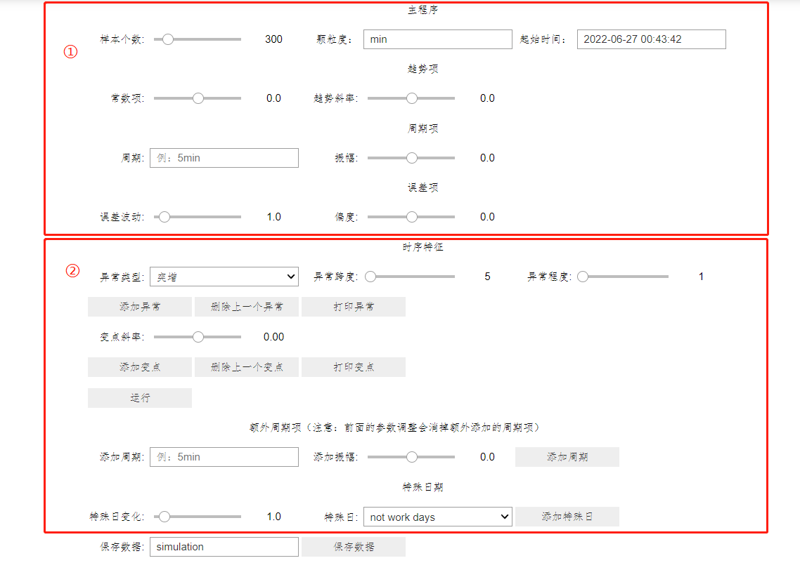

# Time-Series-Simulation
## 时间序列模拟器

该模拟器主要由两大部分组成，第一部分是时间序列的基本参数，由**趋势项、周期项、误差项**三部分组成；第二部分是一些特殊情况的时序特征，由**异常点、变点、额外周期、特殊日期**组成。

### 时间序列基本参数

1、设置时间序列的**范围**和**颗粒度**：

​	--样本个数：int, 时间序列的个数; default: 300

​	--颗粒度：str, 时间颗粒度，default: min

​			--'y':年，'m':月，'w':周，'d':天，'h':小时，'min':分钟，'s':秒
​            --在单位前面加上数字可表示任意颗粒度，如5分钟颗粒度：'5min'；不加数字默认为1

​	--起始时间：str, 模拟时间序列的开始时刻，时间格式为“yyyy-mm-dd h:mm:ss”

2、设置时间序列的**趋势项**：

​	--常数项：线性趋势中的常数项，可以理解为初始值; default: 0

​	--趋势斜率：趋势项的趋势斜率; default: 0

3、设置时间序列的**周期项**：

​	--周期：str, 周期项的周期; default: ''

​            --'w':周，'d':天，'h':小时，'min':分钟，'s':秒

​            --在单位前面加上数字可表示任意颗粒度，如5分钟颗粒度：'5min'

​	--振幅：float, 周期项的周期波动程度; default: 0

4、设置时间序列的**误差项**：

误差服从偏正态分布；

​	--误差波动：float, 误差项的波动程度（偏正态的方差）; default: 1

​	--偏度：float, 偏正态的偏度系数，大于零右偏，出现大于零的值会变多，反之，小于零左偏，出现小于零的值会变多，等于零，则服从正态分布; default: 0

### 时间序列异常参数

1、添加**异常点**：

是指某个时刻突增或突降，然后又回归正常，可以添加多个异常，位置随机；

​	--异常类型：{'突增',  '突降'}, 选择异常类型; default: '突增'

​	--异常跨度：int, 突增或突降的持续时间; default: 5

​	--异常程度：int, 突增或突降的程度，数值越大，变化越大; default: 1

2、添加**变点**：

是指经过变点时刻后，产生不同的趋势，可以添加多个变点，位置随机；

​	--变点斜率：float, 变点后的趋势斜率, default: 0

3、添加**额外周期**：

实现多个不同周期叠加，参数含义见**周期项**

4、添加**特殊日期**变化：

​	--特殊日变化：float, 特殊日期的值相比平时的比值；default: 1

​	--特殊日：{'not work days'}, 特殊日期的选择；default: 'not work days'

​			--'not work days': 非工作日

### 注意：

1、单击“**运行**”按钮，即可生成“**运行**”按钮上方的参数的数据，并画图，单击“**添加周期**”和“**添加特殊日**”按钮会直接生成图片，但需要单击过“**运行**”按钮方可正常添加，每点击一次“**运行**”按钮都会消除之前添加的额外周期和特殊日的规则；

2、单击“**保存数据**”，可将数据导出为csv格式，输入框里可设置文件名。

## 例子：

1、生成一组稳定的周期数据：

通过观察，这组时间序列仅包含周期性的特征，因此只需要设置周期参数和误差项即可：

*注：*

*趋势项里的**常数项**设置是为了是整个时间序列都是正数*

2、生成一组受**工作日周末**影响的数据：

通过观察发现周末的数据比工作日的数据要低一半，可以先**运行**生成只含有有周期的数据，再添加特殊日的参数：

3、生成一组**带趋势**的周期数据：

通过观察发现，这是一条带有趋势的时间序列，可以先**运行**生成一组只含趋势项的时间序列，再**添加特殊日**的参数：

4、

